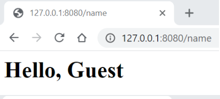

# Lab 4

In this project I learned how create initial Fastify Node.js web server on Javascript. 

### Skills Used in Project
- Installing web server Fastify package
- Initializing package.json
- More practice with .gitignore
- More practice with git commands
- Understanding how to find MIME
- Adding the second route with the contents of "name"
- Creating a website using server side code

